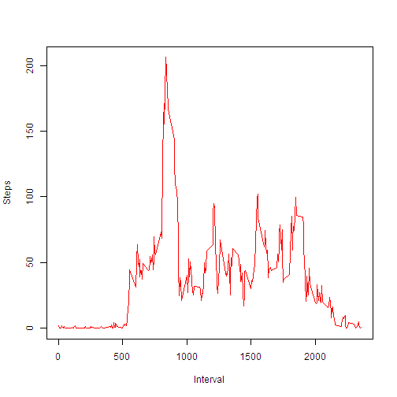

# Reproducible Research: Peer Assessment 1

## Loading and preprocessing the data.
First we'll load the file into the dataframe activity using read.csv. Previously we will check if the .csv file exists, otherwise we will stract it from the ZIP file.

```r
if(!file.exists("./activity.csv")) {unzip("./activity.zip")}
read.csv("./activity.csv", sep = ",") -> activity
```
Then we'll transform the format of the "date"" variable. 

```r
as.Date(activity$date,"%Y-%m-%d")-> activity$date
```
## What is mean total number of steps taken per day?
Now we calculate the total number of steps taken per day and create an HTML table showing the results.

```r
library(knitr)
dataperday<-aggregate(steps ~ date, data=activity, FUN=sum)
dataperday$date <- as.character(dataperday$date)
dataperday->dataperdayFormat
format(dataperday$steps, digits = 2, nsmall = 2, big.mark = ",")-> dataperdayFormat$steps
cbind(dataperdayFormat[1:(dim(dataperday)[1]/4),],
	dataperdayFormat[(dim(dataperday)[1]/4)+1:(dim(dataperday)[1]/4),],
	dataperdayFormat[(dim(dataperday)[1]/2)+1:(dim(dataperday)[1]/4),],
	dataperdayFormat[(dim(dataperday)[1]*3/4)+1:(dim(dataperday)[1]/4),], 
	dataperdayFormat[dim(dataperday)[1],])->dataperdayord
dataperdayord[2:13,9:10]<-""
names(dataperdayord)<-c("Date", " Total Steps","Date", " Total Steps","Date", " Total Steps","Date", 
	" Total Steps","Date", " Total Steps")
kable(dataperdayord, align = c("c","c","c","c","c","c","c","c","c","c"))
```


|    Date    |  Total Steps |    Date    |  Total Steps |    Date    |  Total Steps |    Date    |  Total Steps |    Date    |  Total Steps |
|:----------:|:------------:|:----------:|:------------:|:----------:|:------------:|:----------:|:------------:|:----------:|:------------:|
| 2012-10-02 |     126      | 2012-10-16 |    15,084    | 2012-10-29 |    5,018     | 2012-11-16 |    5,441     | 2012-11-29 |    7,047     |
| 2012-10-03 |    11,352    | 2012-10-17 |    13,452    | 2012-10-30 |    9,819     | 2012-11-17 |    14,339    |            |              |
| 2012-10-04 |    12,116    | 2012-10-18 |    10,056    | 2012-10-31 |    15,414    | 2012-11-18 |    15,110    |            |              |
| 2012-10-05 |    13,294    | 2012-10-19 |    11,829    | 2012-11-02 |    10,600    | 2012-11-19 |    8,841     |            |              |
| 2012-10-06 |    15,420    | 2012-10-20 |    10,395    | 2012-11-03 |    10,571    | 2012-11-20 |    4,472     |            |              |
| 2012-10-07 |    11,015    | 2012-10-21 |    8,821     | 2012-11-05 |    10,439    | 2012-11-21 |    12,787    |            |              |
| 2012-10-09 |    12,811    | 2012-10-22 |    13,460    | 2012-11-06 |    8,334     | 2012-11-22 |    20,427    |            |              |
| 2012-10-10 |    9,900     | 2012-10-23 |    8,918     | 2012-11-07 |    12,883    | 2012-11-23 |    21,194    |            |              |
| 2012-10-11 |    10,304    | 2012-10-24 |    8,355     | 2012-11-08 |    3,219     | 2012-11-24 |    14,478    |            |              |
| 2012-10-12 |    17,382    | 2012-10-25 |    2,492     | 2012-11-11 |    12,608    | 2012-11-25 |    11,834    |            |              |
| 2012-10-13 |    12,426    | 2012-10-26 |    6,778     | 2012-11-12 |    10,765    | 2012-11-26 |    11,162    |            |              |
| 2012-10-14 |    15,098    | 2012-10-27 |    10,119    | 2012-11-13 |    7,336     | 2012-11-27 |    13,646    |            |              |
| 2012-10-15 |    10,139    | 2012-10-28 |    11,458    | 2012-11-15 |      41      | 2012-11-28 |    10,183    |            |              |

Now we'll print the histogram of the total number of steps taken each day;

```r
hist(dataperday$steps, col="blue" ,xlab = "Steps per day", main ="Histogram of steps taken per day")
```

 

### Mean & Median by day.

```r
mean(dataperday$steps)->mean1
median(dataperday$steps)->median1
format(mean1, digits=2, nsmall=2, big.mark=",")-> mean1
format(median1, digits=2, nsmall=2, big.mark=",")-> median1
```
***The mean of the total number of steps is 10,766.19 and the median is 10,765.***

## What is the average daily activity pattern?
Now we will calculate the average steps per interval across all days to show the daily activity pattern and the five minutes interval containing the maximum number of steps.


```r
meanperint<-aggregate(steps ~ interval, data=activity, FUN=mean)
plot(meanperint$interval, meanperint$steps,type="l", xlab="Interval",ylab = "Steps", col="red")
```

 

```r
maxinterval<-meanperint[meanperint$steps==max(meanperint$steps),][1]
meanperint[which(meanperint$steps==max(meanperint$steps))+1,1]->limsup
format(maxinterval/100, decimal.mark=":", nsmall="2")->maxinterval
format(limsup/100, decimal.mark=":", nsmall="2")-> limsup
```

***The five minutes interval, averaged across days, that contains the maximum number of steps is from 8:35 to 8:40.***

## Imputing missing values.

```r
missval<-summary(complete.cases(activity))[2]
```
***The total number of missing values in the dataset (rows with NA's) is: 2304.***

Now I'm going to fill the missings values with the average value per 5 minute time interval of the day, as I think is more indicative of our average activity. The new dataset is modactivity and is equal to the original one + one column "modsteps" that has no NA's.

```r
library(dplyr)
modactivity<-mutate(activity, modsteps=steps)
for ( var in which(is.na(activity[1])=="TRUE")) {
	meanperint[meanperint$interval==activity$interval[var],]->modstep
	modactivity$modsteps[var] <-modstep$steps 
}
```

### Histogram of the total number of steps after filling NA's.


```r
moddataperday<-aggregate(modsteps ~ date, data=modactivity, FUN=sum)
hist(moddataperday$modsteps,col="blue",xlab = "Steps per day",main ="Histogram of steps taken per day (No NA's)")
```

 

### Printting Mean & Median by day after filling NA's.


```r
mean(dataperday$steps)->mean1
median(dataperday$steps)->median1
mean(moddataperday$modsteps)->modmean1
median(moddataperday$modsteps)->modmedian1
diffmean <- modmean1-mean1
diffmedian <- modmedian1-median1
ind<-1
FICH=list(1:length(c(modmean1, modmedian1, diffmean, diffmedian)))
for (f in c(modmean1, modmedian1, diffmean, diffmedian)) {
	format(f, digits=2, nsmall=2, big.mark=",")->FICH[[ind]]
	ind <- ind+1  
}
```
***The mean of the total number of steps after filling the NA's is 10,766.19, the difference with the mean ignoring the NA's is 0.00. The median is 10,766.19 and the difference with the median ignoring NA's is 1.19. So they don't differ too much and this is because of the method choosen to fill the NA's.***


## Are there differences in activity patterns between weekdays and weekends?
First we'll prepare the dataset (sabado & domingo are the Spanish words for Saturday & Sunday).

```r
weekend1<- c("sabado","domingo")
mutate(modactivity, Weekend=date)->modactivity
modactivity$Weekend <- factor((weekdays(modactivity$date) %in% weekend1), 
	levels=c(FALSE, TRUE), labels=c("weekday", "weekend") )
group_by(modactivity, Weekend, interval) %>% summarize(modsteps= mean(modsteps))-> stepsbyweekend
```
### Plotting the time series of the 5 minutes interval and the average number of steps taken, averaged across weekday & weekend.

```r
library(lattice)
xyplot(modsteps ~ interval |Weekend, data=stepsbyweekend, ylab="Steps", type="l",layout=c(1,2))
```

 

***There are some differences in activity patterns between weekdays and weekends, I guess it's due to going to work in weekdays and slepping in the weekend :) and making different activities during the day.***
